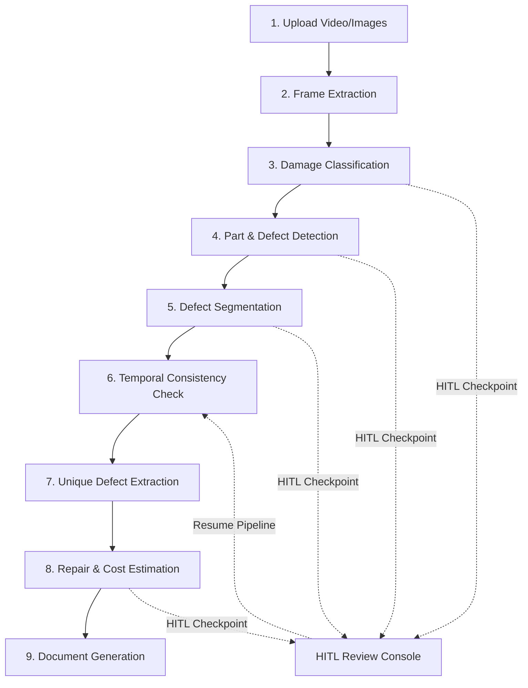

# Maritime Inspection Platform (MaritimeInspect)

Maritime Inspection Platform is an enterprise-grade full-stack system designed to automate, manage, and audit marine vessel inspections. By leveraging advanced Computer Vision (YOLO, PyTorch, OpenCLIP) and GenAI (Gemini), the platform processes vessel inspection videos/images to detect defects, assess severity, suggest repair methods, and generate professional PDF/Word reports.

---

## 🏗️ Project Architecture & Workflow

The platform operates on a **multi-stage AI/Human pipeline** that orchestrates complex detection, classification, and estimation models with integrated **Human-in-the-Loop (HITL)** checkpoints.



### The 8 Pipeline Stages
1. **Frame Extraction** (`FrameExtractionModule`): Processes uploaded media to extract high-quality analysis frames.
2. **Damage Classification** (AI & Human Checkpoint): Employs classification models to detect initial damage types.
3. **Vessel Part & Defect Detection** (AI & Human Checkpoint): Annotates and detects specific ship components (hulls, anchors, etc.) and defects.
4. **Defect Segmentation** (AI & Human Checkpoint): Outlines the precise boundaries of defects.
5. **Temporal Consistency** (`TemporalConsistencyModule`): Filters out transient detection noise across successive video frames.
6. **Unique Defect Frame Extraction** (`UniqueDefectFrameExtractor`): Groups frame-level detections into singular unique defects.
7. **Repair & Cost Estimation** (`RepairEstimationModule`): Leverages Gemini API models to calculate recommended repair workflows and cost estimates.
8. **Document Generation** (`DocumentGenerationModule`): Compiles all approved data into standard inspection reports.

---

## 📈 Current Development Stage

* **Core Pipeline**: Fully functional monolithic FastAPI backend (`backend/`) and React frontend (`frontend/`).
* **AI Pipelines**: YOLOv8 & PyTorch damage classification and part detection are fully integrated.
* **Human-in-the-Loop Validation**: Fully supported. When confidence thresholds require validation, pipelines pause as `awaiting_review`, allowing inspectors to use the HITL Review Page to confirm or draw boundary boxes.
* **Localization**: Fully supports English and Indonesian languages.
* **Next Stage Roadmap**: Detailed architecture transition plan is laid out in [docs/enterprise-maritime-architecture.md](file:///e:/maritime_application2/docs/enterprise-maritime-architecture.md). It outlines moving from the current FastAPI+MongoDB monolith towards a production-ready microservices model utilizing Celery tasks, Redis caching/queues, and MinIO object storage.

---

## 🛠️ Technology Stack

### Backend
- **Core Framework**: FastAPI, Uvicorn, Python 3.9+
- **Database**: MongoDB (utilizing Motor async driver)
- **Rate Limiting & Security**: SlowAPI, PyJWT, Passlib (Bcrypt)
- **AI & Analytics**: PyTorch, Ultralytics YOLOv8, OpenCLIP, Google GenAI (Gemini API)
- **Document Generation**: python-docx, Pillow

### Frontend
- **Core Framework**: Vite + React 19 + TypeScript
- **Styling**: Tailwind CSS + Material-UI (MUI v7)
- **State Management**: Zustand
- **Graphics & Annotation Canvas**: React-Konva & Konva (for drawing and modifying defect boxes)
- **Data Visualization**: Recharts, Material React Table

---

## 📂 Project Structure

```text
maritime_application2/
├── backend/                   # FastAPI Server, Routes, and ML modules
│   ├── database/              # Async MongoDB connector & schema index definitions
│   ├── final_models/          # Pre-trained ML model checkpoints (.pt weights)
│   ├── modules/               # AI pipeline modules (frame extraction, repair estimation, etc.)
│   ├── pipeline_runner.py     # Main inspection pipeline orchestration
│   ├── routes/                # FastAPI endpoint routers (vessels, defects, auth, reports)
│   └── services/              # Common storage, model loading, and business services
├── frontend/                  # React Application
│   ├── src/
│   │   ├── pages/             # Dashboard, Defect Review, Vessel Profile, HITL Pages
│   │   ├── components/        # Reusable UI elements (Konva Canvas, charts)
│   │   └── router.tsx         # Route configurations
│   └── package.json           # Frontend script triggers and dependencies
├── docs/                      # Technical plans and documentation
├── nginx/                     # Reverse proxy routing definitions
└── start-maritimeinspect.ps1  # Orchestrated PowerShell startup script
```

---

## 🚀 Setup & Installation (Developer Guide)

### 1. Prerequisites
- **Python 3.9+** (Ensure it is added to your PATH)
- **Node.js 18+**
- **MongoDB** running locally on port `27017`

### 2. Model Checkpoints / Weights
Unlike typical ML repos, the pre-trained weights for vessel defect analysis are **already bundled** in the repository under `backend/final_models/`:
* `yolo26m_classification_best.pt` - Classification model.
* `yolo26m_part_seg_best.pt` - Part detection and segmentation model.
* `yolo_seg_deformation_best.pt` - Defect/deformation segmentation model.
*No extra model downloads are required to start working.*

### 3. Database Initialization
MongoDB indexes are automatically created and initialized when the FastAPI backend application starts up (see [backend/database.py](file:///e:/maritime_application2/backend/database.py)'s `connect_to_mongo` function).
* A unique index is generated on `imo` in the `vessels` collection.
* A unique index is generated on `defect_id` in the `defect_registry` collection.

### 4. Backend Setup
1. Navigate to the backend directory:
   ```bash
   cd backend
   ```
2. Create and activate a virtual environment:
   ```bash
   python -m venv venv
   # On Windows:
   venv\Scripts\activate
   # On Mac/Linux:
   source venv/bin/activate
   ```
3. Install dependencies:
   ```bash
   pip install -r requirements.txt
   ```
4. Set up environment variables:
   Copy `.env.example` to `.env` and fill in your keys:
   ```bash
   cp .env.example .env
   ```
   * `GEMINI_API_KEY`: **Mandatory** for Cost & Repair Estimation modules.
   * `SUPABASE_URL` & `SUPABASE_KEY`: Optional; configuration for cloud integrations.

### 5. Frontend Setup
1. Navigate to the frontend directory:
   ```bash
   cd frontend
   ```
2. Install dependencies:
   ```bash
   npm install
   ```

---

## 💻 Running the App (Orchestrated Scripts)

You can launch all parts of the application directly from the workspace root directory using root npm commands or PowerShell scripts:

### 1. Standard Mode (Rebuilds & Previews Frontend)
Starts both the FastAPI backend (Port 8000) and the built React frontend client (Port 5173):
```bash
npm run start
# Or via powershell directly:
powershell -ExecutionPolicy Bypass -File .\start-maritimeinspect.ps1
```

### 2. Hot-Reloading UI Dev Mode
If you are modifying the React UI and want fast hot-module replacement (HMR):
```bash
npm run dev:local
# Or via powershell:
powershell -ExecutionPolicy Bypass -File .\start-maritimeinspect.ps1 -FrontendMode dev -StartHitl
```

### 3. Ports Map Reference
* **Main Frontend Client**: `http://localhost:5173` (Runs the primary inspection dashboards)
* **HITL Review Console**: `http://localhost:5174` (A separate frontend context loaded via `VITE_APP_MODE=hitl` for human review)
* **FastAPI Backend & API Docs**: `http://localhost:8000/docs` (Includes the interactive Swagger API sandbox)

---

## 🐳 Docker Deployment
To spin up the entire system (FastAPI API server, React frontend, Nginx reverse proxy, and MongoDB) in containerized mode:
```bash
docker-compose up --build
```
* **Main Frontend**: http://localhost
* **API Service**: http://localhost/api/v1
* **MongoDB**: runs internally with port 27017 exposed for debugging
